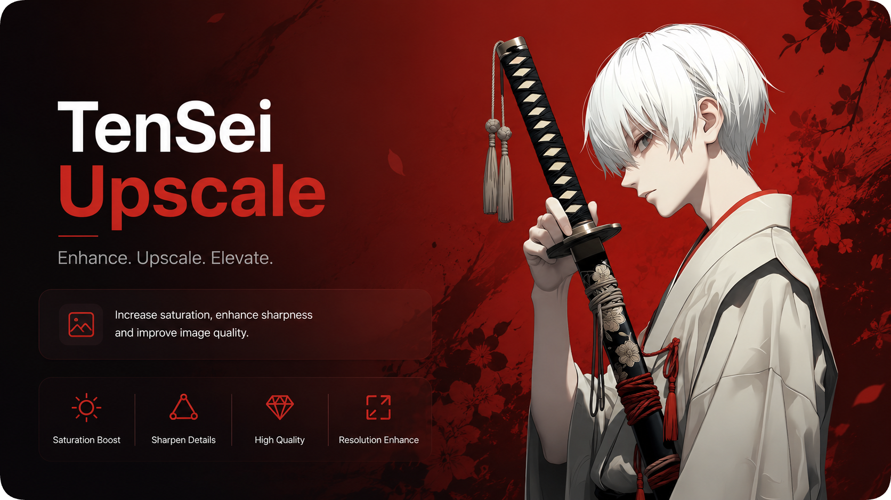
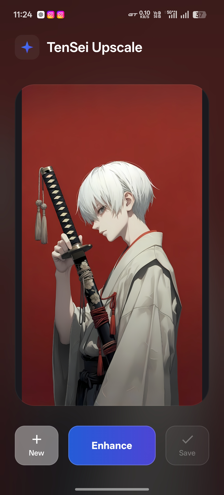
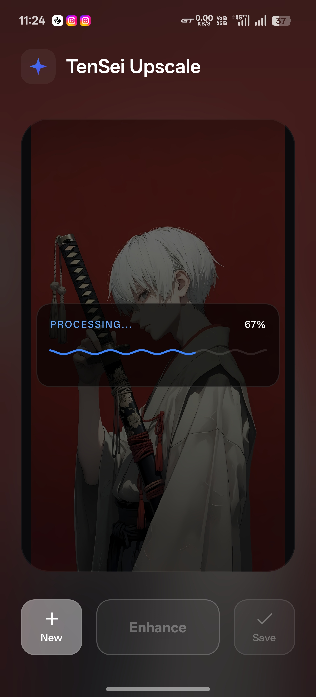
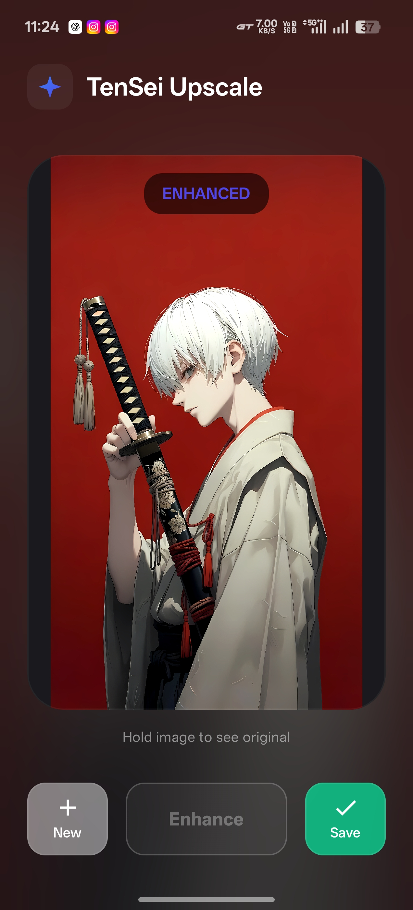

  

  <h1>✨ TenSei Upscale ✨</h1>
  
<strong>A sleek, intuitive Android application for upscaling and enhancing image quality locally on your device.</strong>

  
  
  

 

## 📱 Screenshots

  <table>
    <tr>
      <td align="center"></td>
      <td align="center"></td>
      <td align="center"></td>
    </tr>
    <tr>
      <td align="center"><b>Home Screen</b></td>
      <td align="center"><b>Progress UI</b></td>
      <td align="center"><b>Enhanced Result</b></td>
    </tr>
  </table>

## 🌟 Key Features

| Feature | Description |
| :--- | :--- |
| **High-Definition Upscaling** | Scale smoothly without aggressive pixelation to recover details. |
| **Local Processing** | Keeps everything on your device to maintain strict user privacy. |
| **Material Glass UI** | Stunning, modern interface with adaptive blurs and liquid animations. |
| **Gallery Integration** | Instantly saves directly to your device's Pictures folder in pristine quality. |

## 📥 Installation

> **Note:** We provide pre-compiled APKs for easy installation. You do not need to build the source code yourself.

1. Go to the [Releases](../../releases) tab on this GitHub repository.
2. Download the latest `TenSei-Upscale.apk`.
3. Open the APK on your Android device and install it (you may need to allow installations from unknown sources).
4. Launch **TenSei Upscale** and enjoy!

## 🤝 Credits
- Modern icons are provided by Material Symbols.
- Image processing leverages Android RenderScript and Bitmap color matricies.

## 📄 License & Usage

**Copyright (c) 2026 Koustubh Gaikwad (TenSei). All rights reserved.**

This source code is provided for educational and review purposes only.
- You **may** view the code and use the provided APKs for your personal needs.
- You **must obtain explicit written permission** from the author before editing, modifying, adding new functions, or distributing this software for commercial or public purposes.
- If you use or fork this codebase to create a new application or feature, you **MUST** seek permission first.

---

  <i>Created by Koustubh Gaikwad (TenSei)</i>

